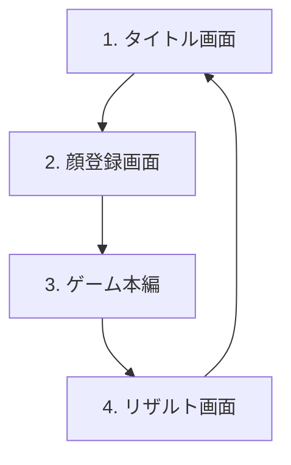

# Face Raiders Web (仮)

ニンテンドー3DSの「顔シューティング」をベースとした、フロントエンド完結型のWebARシューティングゲームです。カメラ映像とデバイスのジャイロセンサーを活用し、あなたの顔（または登録した顔）が敵となって3D空間を飛び回る、ユニークなAR体験を提供します。

---

## 主な特徴

- **顔が敵になる不気味さと面白さ**
  インカメラで撮影した顔画像を丸型に切り抜き、敵キャラクターのテクスチャとして3D空間に登場させます。
- **フロントエンド完結（サーバーレス）**
  すべてのゲームロジック、画像処理、状態管理はクライアントサイド（ブラウザ）で動作します。データベースや外部サーバーへのデータ送信は行いません。
- **ジャイロ連動の疑似WebAR**
  背面カメラのリアルタイム映像を背景に投影。スマートフォンのジャイロセンサー（デバイスの傾き・向き）と連動し、360度見回せる仮想3D空間に敵が出現します。
- **直感的な操作と演出**
  画面中央の照準をデバイスの動きで敵に合わせ、画面タップで弾を発射して撃破します。敵が画面にぶつかると「画面が割れる」ビジュアルエフェクトなどのユニークな演出があります。

---

## ゲームフロー

ゲームは以下の4つの画面（ステート）で構成されています。



1. **タイトル画面**: ゲームの開始口。カメラやセンサーの許可についての案内を表示します。
2. **顔登録画面**: インカメラを使用して顔写真を撮影し、敵キャラクター用の顔テクスチャを生成します。
3. **ゲーム本編**: 背面カメラ映像を背景に、3D空間に出現する敵と戦うARシューティングパートです。
4. **リザルト画面**: 最終スコアや撃破数、ランク（S〜C）を表示し、再プレイやタイトルへの遷移を行います。

---

## 技術スタック

- **Core**: React 19, TypeScript
- **Build Tool**: Vite 8, pnpm
- **3D Graphics**: `Three.js` (または `Babylon.js`)
- **Sensor**: ブラウザ標準 `DeviceOrientationEvent`
- **Lint**: Oxlint
- **Deployment**: Vercel (GitHub Actionsによる自動デプロイ)

---

## 開発環境のセットアップ

### 必要な環境
- Node.js (Vite 8 と React 19 が動作する環境)
- `pnpm` (パッケージマネージャー)

### パッケージのインストール
```bash
pnpm install
```

### 開発用ローカルサーバーの起動
```bash
pnpm dev
```

### ビルド
```bash
pnpm build
```

### リンターの実行 (Oxlint)
```bash
pnpm lint
```

---

## 詳細仕様書

ゲームのより詳細な要件定義や画面遷移、技術仕様については、以下のドキュメントを参照してください。
- [仕様書 (specification.md)](docs/specification.md)
