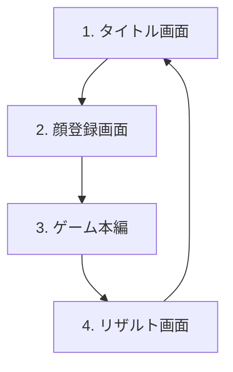

# WebAR顔シューティングゲーム「Face Raiders Web (仮)」仕様書

本ドキュメントは、ニンテンドー3DSの「顔シューティング」をベースとした、フロントエンド完結のWebARシューティングゲーム「Face Raiders Web (仮)」のシステムおよびデザインの仕様を定義するものです。

---

## 1. プロジェクト概要

### 1.1 目的
スマートフォンやPCのWebブラウザで動作する、カメラ映像とジャイロセンサーを活用したARシューティングゲームを開発する。バックエンドやデータベースは一切使用せず、すべての状態管理、アセット処理、ゲームロジックをクライアントサイド（フロントエンド）で完結させる。

### 1.2 コア体験
- **自分の顔が敵になる不気味さと面白さ**: カメラで撮影した自分の顔（または友達やペットの顔）が切り抜かれ、3Dの敵キャラクターとして画面内に飛び交う。
- **現実空間とバーチャルの融合 (WebAR)**: デバイスの背面カメラ映像を背景にし、ジャイロセンサー（デバイスの傾き・向き）と連動して360度見回せる仮想3D空間に敵が出現する。
- **直感的な操作**: 画面中央の照準をデバイスの動きで敵に合わせ、画面タップで弾を発射して撃破する。

---

## 2. 画面遷移とゲームフロー

ゲームは以下の4つの画面（ステート）で構成される。

### 2.1 タイトル画面 (Title Screen)
*   **概要**: ゲームの開始口。
*   **表示要素**:
    *   ゲームタイトルロゴ
    *   「ゲームスタート」ボタン
    *   遊び方の簡単な説明（カメラとセンサーの許可が必要である旨の明記）

### 2.2 顔登録画面 (Face Registration Screen)
*   **概要**: カメラを起動し、敵キャラクターのテクスチャとなる「顔」をキャプチャする。
*   **表示要素 / インタラクション**:
    *   **カメラプレビュー**: インカメラ（前面カメラ）の映像をリアルタイムで中央のフレーム（楕円形または丸型）に表示。
    *   **ガイドライン**: 「顔を枠に合わせてください」という案内と、目・口の位置を示す補助線。
    *   **シャッターボタン**: タップで静止画を撮影。
    *   **トリミングプレビューと確認**:
        *   撮影後、自動または手動で顔部分を円形にクロップしたプレビューを表示。
        *   「この顔で決定」または「撮り直す」を選択。

### 2.3 ゲーム本編画面 (Game Play Screen)
*   **概要**: 背面カメラの映像を背景に、3D空間で敵（顔キャラクター）と戦う。
*   **画面UI**:
    *   **背景**: 背面カメラのリアルタイム映像（フルスクリーン）。
    *   **照準 (Reticle)**: 画面中央に固定されたスナイパー風の照準器。
    *   **プレイヤー情報**:
        *   現在のスコア（画面上部）
        *   残りライフ（HPバーまたはハートマーク、画面左下）
        *   残り時間またはウェーブ情報
        *   コンパス/ミニマップ（敵がどの方向（前後左右）にいるかを示すインジケーター）
    *   **ポーズボタン**: 一時停止およびタイトルへの離脱用。
*   **ゲームロジック**:
    *   **敵の生成**: プレイヤーの周囲360度のランダムな位置に、登録した顔を持つ「顔ヘリコプター」や「顔UFO」などの3D敵オブジェクトが出現。
    *   **操作**: デバイスを物理的に動かす（ジャイロ）ことでカメラアングルが変わり、3D空間を見回す。
    *   **攻撃**: 画面タップで照準から弾（コメディタッチなもの、例えばテニスボールや吸盤矢など）が発射される。
    *   **被弾/衝突判定**: 敵が弾に当たるとエフェクト（火花、顔の歪み）とともにダメージを受け、HPがゼロになると破裂して消滅。
    *   **敵の攻撃**: 敵が画面外から体当たりしてきたり、弾を投げてきたりする。敵が画面にぶつかると「画面が割れる」ビジュアルエフェクトが発生し、プレイヤーのライフが減少。

### 2.4 リザルト画面 (Result Screen)
*   **概要**: ゲーム終了後のスコアを表示する。
*   **表示要素**:
    *   最終スコア（アニメーション付きでカウントアップ）
    *   撃破した敵の数
    *   ランク判定（S, A, B, C...）
    *   「もう一度遊ぶ」ボタン
    *   「タイトルへ」ボタン

---

## 3. 機能要件

### F-1: カメラキャプチャ & 画像処理
*   **要件**: ユーザーのブラウザからカメラ（前面/背面）へのアクセスを要求し、ビデオストリームを取得する。
*   **顔の切り抜き**:
    *  撮影したフレームから中央の円形領域を切り抜き、テクスチャデータとしてメモリ上に保持する。
    *  円形のマスクによるトリミングを行う。

### F-2: 擬似AR表示 (3D & ジャイロ)
*   **要件**:
    *   **背面カメラ背景**: カメラの映像を背景として全画面描画する。
    *   **3Dオーバーレイ**: その上に3Dの敵や弾を描画する。
    *   **センサー制御**: スマートフォンの `DeviceOrientationEvent`（`alpha` (方位角), `beta` (前後傾き), `gamma` (左右傾き)）を検知し、カメラの回転角度にマッピングする。これにより、デバイスを動かすと3D空間も同様に動き、現実世界に敵が浮いているような体験を作る。
    *   *注意*: iOS (Safari) では、HTTPS環境での実行と、ユーザーインタラクション（ボタンタップなど）を契機としたデバイスセンサーの明示的なアクセス許可（`DeviceOrientationEvent.requestPermission()`）が必要。

### F-3: ゲームエンジン/物理衝突判定
*   **要件**:
    *   3D空間内でのレイキャスティング（Raycasting）による、画面中央 of 照準と敵モデルとの当たり判定。
    *   敵からプレイヤー（カメラ位置）への移動、および弾丸の3D軌道計算。
    *   敵の行動パターン（ランダム移動、プレイヤーに向かって突進、画面外への回り込み）。

---

## 4. 非機能要件

### N-1: パフォーマンスと最適化
*   WebARはCPU/GPUへの負荷が高いため、フレームレート（ターゲット60fps）を維持するための最適化を行う。
    *   顔テクスチャの解像度は256x256〜512x512程度に抑える。
    *   3Dオブジェクトのポリゴン数は抑え、シンプルなジオメトリ（球体や立方体に顔を貼り付けたもの）やビルボード（常にカメラを向く2Dプレート）を使用する。
*   React 19のCompilerによるレンダリング最適化を活かし、余計な再レンダリングを抑止する。

### N-2: レスポンシブ & モバイルファースト
*   スマートフォン（iOS/Android）の縦画面でのプレイをプライマリターゲットとする。
*   UIはタッチフレンドリーにし、ボタンサイズやタップ領域を十分に確保する。

---

## 5. 技術スタック

*   **フレームワーク**: React 19, TypeScript
*   **ビルドツール**: Vite 8, pnpm
*   **3D描画ライブラリ**: `Three.js` または `Babylon.js`
*   **センサー制御**: ブラウザ標準 `DeviceOrientationEvent`
*   **顔認識（オプション）**: `face-api.js` またはシンプルな Canvas クロップ
*   **スタイリング**: CSS Modules
*   **アセット管理**: `public/` ディレクトリ内に効果音（SE/BGM）と基本的な3Dパーツ用のテクスチャを配置。